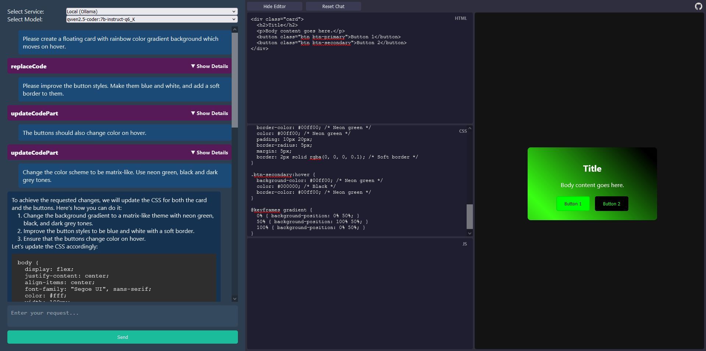

# LLM-Pen

LLM-Pen is a web-based application built with Vue.js and Vite that allows users to chat with either OpenAI's language models or a locally hosted model via Ollama. The site is deployed on GitHub Pages and operates entirely in the browser, without requiring a backend server. It can also be cloned and run locally for development or offline use.



## Features

- **OpenAI Model**: Chat with an OpenAI-based language model directly from the web interface.
- **Local Model (Ollama)**: Switch to a local Ollama-hosted model for offline usage.
- **Vue.js**: The application is built using Vue.js, offering a responsive and modern UI.
- **Vite**: Vite is used for fast development and bundling.
- **No Backend Required**: The project is deployed on GitHub Pages, making it easy to use directly from the browser without a backend.

## Live Demo

You can access the live version of the site here:  
[LLM-Pen Live Demo](https://danmoreng.github.io/llm-pen/)

## Getting Started

To run the project locally:

1. **Clone the repository:**
    ```bash
    git clone https://github.com/danmoreng/llm-pen.git
    ```

2. **Navigate to the project directory:**
    ```bash
    cd llm-pen
    ```

3. **Install the dependencies:**
    ```bash
    npm install
    ```

4. **Start the development server:**
    ```bash
    npm run dev
    ```

5. Open the local development server link provided by Vite (usually `http://localhost:5173/`).

To build the project for production, use:
```bash
npm run build
```

## Usage

- **OpenAI Model**: Interact with an OpenAI language model via the browser.
- **Local Model (Ollama)**: Run the model locally if you have Ollama installed and configured.

The app offers a card-based interface with two buttons to choose between models. The UI is centered and styled with modern, bright colors to enhance user experience.

### Disclaimer
- **OpenAI API Key**: If you choose to use the OpenAI model, you will need to provide your own OpenAI API key. This is not provided by the application.
- **Ollama Configuration**: If you're using the application with the Ollama model from the live GitHub Pages version, ensure that **Ollama is configured to allow CORS (Cross-Origin Resource Sharing)** to enable proper communication between the browser and your local Ollama instance.

## License

This project is licensed under the MIT License. See the [LICENSE](LICENSE) file for more information.

## Contributing

Contributions are welcome! Feel free to submit a pull request or open an issue for any bugs, suggestions, or feature requests.

## Contact

For questions or feedback, please open an issue on the [GitHub repository](https://github.com/danmoreng/llm-pen).
