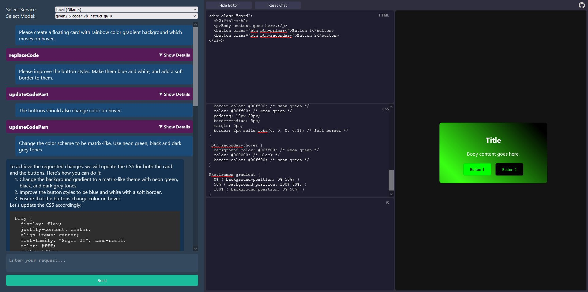
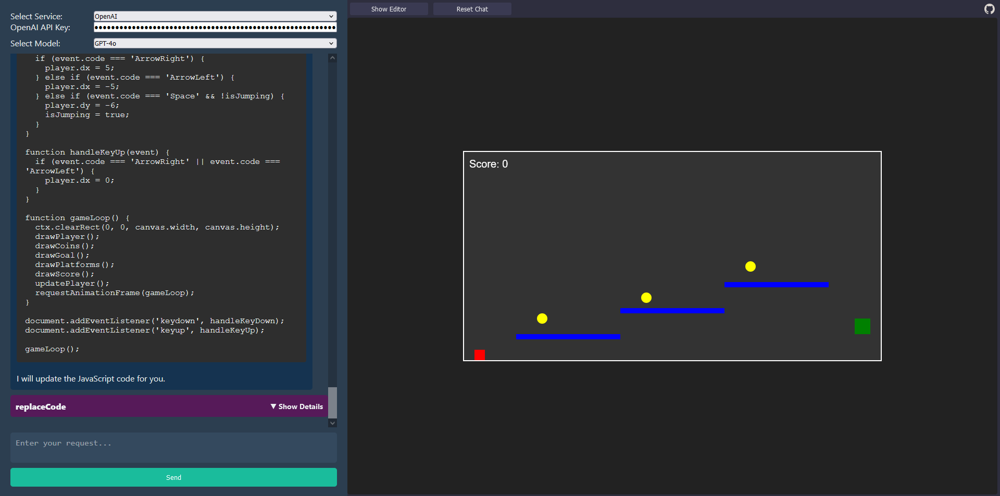

# LLM-Pen

LLM-Pen is a web-based application built with Vue.js and Vite that allows users to chat with various language models including OpenAI's models, locally hosted models via Ollama, Google's Gemini models, and llama.cpp models. The site is deployed on GitHub Pages and operates entirely in the browser, without requiring a backend server. It can also be cloned and run locally for development or offline use.



## Features

- **Multiple LLM Backends**: Support for OpenAI, Ollama, Google Gemini, and llama.cpp models
- **Enhanced Code Editing Functions**: 
  - `replaceCode`: Replace entire sections of HTML, CSS, or JavaScript
  - `updateCodePart`: Update specific parts of a section by finding and replacing target strings
  - `insertCodeAtPosition`: Insert new code at specific line numbers
  - `deleteCodeBlock`: Delete blocks of code between specific line numbers
- **Vue.js**: The application is built using Vue.js, offering a responsive and modern UI.
- **Vite**: Vite is used for fast development and bundling.
- **No Backend Required**: The project is deployed on GitHub Pages, making it easy to use directly from the browser without a backend.

## Live Demo

You can access the live version of the site here:  
[LLM-Pen Live Demo](https://danmoreng.github.io/llm-pen/)

## Getting Started

To run the project locally:

1. **Clone the repository:**
    ```bash
    git clone https://github.com/danmoreng/llm-pen.git
    ```

2. **Navigate to the project directory:**
    ```bash
    cd llm-pen
    ```

3. **Install the dependencies:**
    ```bash
    npm install
    ```

4. **Start the development server:**
    ```bash
    npm run dev
    ```

5. Open the local development server link provided by Vite (usually `http://localhost:5173/`).

To build the project for production, use:
```bash
npm run build
```

## Supported LLM Backends

LLM-Pen supports four different LLM backends:

1. **OpenAI**: Use any OpenAI model by providing your API key
2. **Ollama**: Use locally hosted models via Ollama (requires Ollama installation)
3. **Google Gemini**: Use Google's Gemini models by providing your API key
4. **llama.cpp**: Use locally hosted llama.cpp models (requires llama.cpp server installation)

### Backend Setup Instructions

#### OpenAI
- Select "OpenAI" from the service dropdown
- Enter your OpenAI API key when prompted
- Select the model you want to use (e.g., gpt-4, gpt-3.5-turbo)

#### Ollama
- Install and run Ollama locally (https://ollama.com/)
- Select "Local (Ollama)" from the service dropdown
- Select the model you want to use from the available models list
- Note: Ollama must be configured to allow CORS for web access

#### Google Gemini
- Select "Google Gemini" from the service dropdown
- Enter your Google Gemini API key when prompted
- Select the model you want to use from the available models list

#### llama.cpp
- Install and run llama.cpp server locally (https://github.com/ggerganov/llama.cpp)
- Select "llama.cpp" from the service dropdown
- Select the model you want to use from the available models list
- Note: The llama.cpp server must be running on localhost:8080

## Usage

- **Multiple LLM Backends**: Switch between OpenAI, Ollama, Google Gemini, and llama.cpp models using the service selector.
- **Enhanced Code Editing**: The AI can now perform more precise code modifications using the enhanced functions:
  - Replace entire sections of code
  - Update specific parts of code
  - Insert new code at specific positions
  - Delete unwanted code blocks

### Disclaimer
- **API Keys**: If you choose to use OpenAI or Google Gemini models, you will need to provide your own API keys. These are not provided by the application.
- **Local Model Configuration**: If you're using the application with Ollama or llama.cpp models from the live GitHub Pages version, ensure that the respective servers are configured to allow CORS (Cross-Origin Resource Sharing) to enable proper communication between the browser and your local instances.

## Enhanced Code Editing Functions

LLM-Pen now includes enhanced code editing functions that allow the AI to perform more precise modifications to your code:

1. **replaceCode(section, newCode)**: Replaces the entire content of the specified section (HTML, CSS, or JavaScript).
2. **updateCodePart(section, target, newContent)**: Finds the specified target string in the section and replaces it with the provided newContent.
3. **insertCodeAtPosition(section, lineNumber, newCode)**: Inserts new code at a specific line number in the specified section.
4. **deleteCodeBlock(section, startLine, endLine)**: Deletes a block of code from the specified section between two line numbers.

These functions enable more precise control over code modifications, allowing the AI to make targeted changes without affecting other parts of your code.

## Example using GPT4o


### Queries:

1. ```Please implement a simple platform jump game, where a character has to move from left to right, collect coins and reach the goal. Use basic shapes for character, coins and game level design.```

2. ```Can you add some platforms where I can jump on? One coin is not reachable.```

### Result
https://codepen.io/danmoreng/pen/MWNeGYR

## License

This project is licensed under the MIT License. See the [LICENSE](LICENSE) file for more information.

## Contributing

Contributions are welcome! Feel free to submit a pull request or open an issue for any bugs, suggestions, or feature requests.

## Contact

For questions or feedback, please open an issue on the [GitHub repository](https://github.com/danmoreng/llm-pen).
